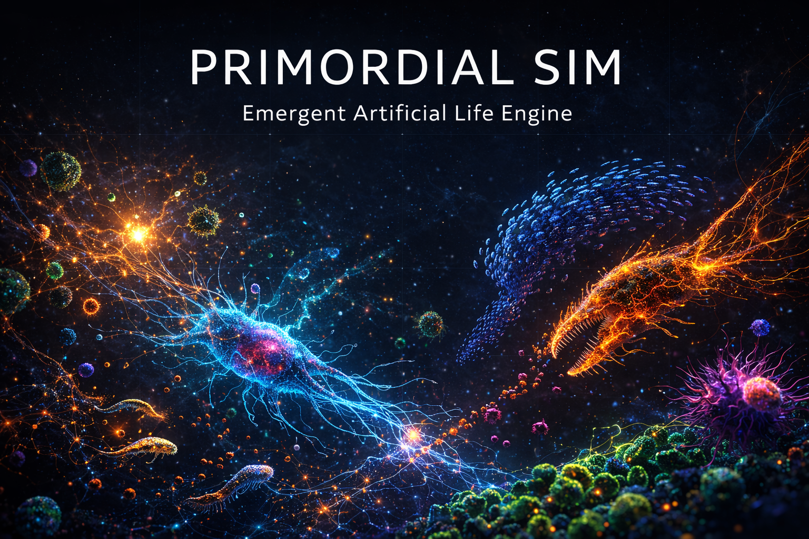

# Primordial-Sim

### Emergent Artificial Life Engine

A real-time WebGL particle ecosystem where organisms eat, hunt, flee, flock, reproduce, mutate, and evolve — all from simple rules, all in your browser.

**[Launch Primordial](https://jkh2.github.io/Primordial-Sim/)** · Single-file HTML · Zero install · GitHub Pages

Built by [Sentinel AI Systems](https://github.com/jkh2) × Claude Sentinel — SIDLF Partnership

---

## What It Is

Primordial is a continuous-space ecosystem simulator running on WebGL. Every colored dot on screen is a living organism with position, velocity, energy, age, a species identity, and four genetic traits that mutate across generations. Organisms eat food pellets to gain energy, grow larger, hunt smaller organisms of other species, flee from predators, flock with their own kind to form territories, reproduce when they reach a threshold size, and die of starvation or old age.

No behavior is scripted. Territories, migration patterns, population cycles, predator-prey dynamics, and evolutionary adaptation all emerge naturally from five simple behavioral drives and the physics of survival.

## What It Does

**Ecosystem mechanics** — Organisms consume food pellets scattered across the map (with configurable fertile "oases" that concentrate resources geographically). Energy drives growth: size equals the square root of energy, so bigger organisms need proportionally more food to sustain themselves. When an organism of one species is sufficiently larger than an organism of another species, it eats the smaller one, gaining energy and triggering a burst of death particles in the victim's color. Same-species organisms are protected from cannibalism by default, encouraging territorial clustering.

**Genetic evolution** — Every organism carries four heritable genes: Speed (movement multiplier), Aggression (hunt drive intensity), Efficiency (metabolic cost reduction), and Perception (sight range for food and threats). When an organism reproduces, each gene has a configurable probability of mutating by a random amount. Over hundreds of generations, species diverge — some lineages become fast grazers, others become slow efficient apex predators, others develop wide perception ranges to find scarce food. Natural selection is the only force shaping this. No fitness function, no selection pressure beyond survival itself.

**Predator-prey food chains** — An optional Rock-Paper-Scissors mode creates circular predation: each species hunts the next one in sequence, wrapping around. This prevents any single species from dominating and produces classic Lotka-Volterra population oscillations visible in the real-time population graph.

**Interactive sandbox** — Left-click drops a cluster of food pellets. Right-click spawns a group of organisms. Hover over any organism to inspect its species, size, energy, age, kill count, and all four gene values. Keyboard shortcuts control time: Space pauses, 1-4 set speed from slow-motion to 5x turbo. Six tuned scenario presets offer distinct experiences from peaceful aquariums to extinction events.

**Ambient sound design** — An optional Web Audio layer provides a low drone that shifts pitch with total population (rising hum = thriving world, falling = collapse), soft pops on reproduction events, and bass thuds when large predators make kills.

## Why It's Useful

**Education** — Primordial makes abstract ecological and evolutionary concepts tangible. Natural selection, predator-prey dynamics, carrying capacity, competitive exclusion, genetic drift, and the tragedy of the commons all emerge visibly without any scripting. Students and curious minds can watch these processes happen in real time and manipulate the parameters to test hypotheses.

**Research intuition** — For anyone working in ecology, evolutionary biology, agent-based modeling, or complex systems, LifeSimmer provides a fast interactive sandbox for building intuition about how parameter changes cascade through an ecosystem. Crank the mutation rate and watch speciation happen. Restrict food supply and observe which traits survive the bottleneck.

**Artificial life exploration** — The simulation demonstrates how complex collective behavior emerges from simple individual rules — a core principle in artificial life, swarm intelligence, and complex adaptive systems research. Five behavioral drives (hunt, flee, flock, eat, separate) plus energy physics produce territorial warfare, migration patterns, evolutionary arms races, and population oscillations with no top-down coordination.

**It's also just fun to watch.** Turn on trails, set it to Battle Royale, go fullscreen, and watch 12,000 organisms fight for survival in a world with almost no food. Or set it to Superorganism and watch species move as tight swarms like amoebas under a microscope. The emergent behavior is endlessly surprising.

## How It Works

### Architecture

Primordial is a single self-contained HTML file with no dependencies, no build step, and no backend. It runs entirely client-side using:

- **WebGL** for rendering — organisms and food are drawn as point sprites with per-particle hue, alpha, and size attributes, pushed to the GPU every frame via dynamic buffer uploads
- **Structure of Arrays (SoA)** for organism data — parallel Float32Array/Uint8Array buffers for position, velocity, size, energy, species, age, genes, and alive-state, supporting up to 60,000 entities with cache-friendly memory access
- **Spatial hash grid** for neighbor lookups — a 40px cell grid with 64 entities per cell turns O(n²) neighbor scanning into O(1) per organism, making 50k organisms feasible at 60fps on consumer hardware
- **Separate food grid** for efficient food-seeking with wider search radius for organisms with high perception genes
- **Web Audio API** for procedural ambient sound design — no audio files, just oscillators and gain nodes

### Simulation Loop

Each frame:

1. **Spawn food** — new pellets appear at the configured rate, biased 60/40 toward food oases vs random placement
2. **Build spatial grids** — organisms and food are bucketed into their grid cells
3. **Per-organism behavioral step** — for each alive organism, scan the 3x3 (or 5x5 for food chain mode) neighborhood of grid cells. Accumulate five force vectors: hunt (toward smaller edible prey), flee (away from larger predators), flock (toward same-species center of mass), food attraction (toward nearest pellet), and separation (away from overlapping neighbors). Check for eat/collision events. Apply wander noise for organic movement
4. **Integrate physics** — apply accumulated forces scaled by the organism's genetic speed multiplier and size-based speed penalty (bigger = slightly slower). Clamp velocity, update position, wrap edges
5. **Metabolism** — deduct energy scaled by the organism's efficiency gene. Update size from energy. Check for death (starvation or old age) and reproduction (size threshold met with sufficient energy)
6. **Reproduce with mutation** — offspring inherit parent's genes with configurable mutation probability and strength per gene
7. **Update death particles** — fade and drift any active kill/death effects
8. **Render** — clear or fade the previous frame, build the GL attribute arrays (food → death particles → organisms), upload to GPU, draw

### Scenario Presets

| Preset | Organisms | Food | Species | Character |
|--------|-----------|------|---------|-----------|
| Stable Eden | 4,000 | 3,000 | 5 | Peaceful aquarium, high food, low aggression, territories form gradually |
| Arms Race | 5,000 | 1,800 | 4 | High mutation drives rapid evolution under moderate scarcity |
| Battle Royale | 12,000 | 600 | 6 | Massive population, almost no food, fast carnage, most species go extinct |
| Superorganism | 6,000 | 2,500 | 4 | Max flocking — species move as tight swarms like slime molds |
| Food Chain Cycle | 4,500 | 2,200 | 3 | Rock-paper-scissors predation, classic oscillating population waves |
| Extinction Event | 8,000 | 4,000 | 8 | Abundant start, food dries up, slow die-off reveals which traits survive |

### Controls

| Input | Action |
|-------|--------|
| Left click | Drop food cluster |
| Right click | Spawn organism group |
| Hover | Inspect organism (species, size, energy, age, kills, genes) |
| Space | Pause / Resume |
| 1 / 2 / 3 / 4 | Speed: 0.5x / 1x / 2x / 5x |
| S | Toggle sound |

### UI Tabs

- **World** — organism count, food settings, speed, population graph, species census
- **Species** — species count, sizes, speed, lifespan, reproduction thresholds, food oases
- **Rules** — predation settings, food chain toggle, behavioral drive sliders (hunt, flee, flock, food attraction, separation)
- **Evolve** — mutation on/off, mutation rate and strength, per-trait evolution toggles (speed, aggression, efficiency, perception)
- **Visual** — additive glow, death particles, oasis indicators, food glow intensity, trail length

## Deployment

Primordial is a single `index.html` file. To deploy:

1. Clone this repository
2. Enable GitHub Pages (Settings → Pages → Source: main branch)
3. Visit `https://jkh2.github.io/Primordial-Sim/`

Or just open the HTML file directly in any modern browser. No server, no build, no dependencies.

## Performance

Tested configurations:

- **Desktop (1080p+)**: 8,000–20,000 organisms at 60fps
- **Laptop**: 5,000–8,000 organisms at 60fps
- **Mobile**: 2,000–4,000 organisms at 30-60fps (adaptive startup detects device capability)

The spatial hash grid is the key performance enabler — without it, 50,000 organisms would require 2.5 billion pairwise distance checks per frame. With it, each organism only checks ~30-50 neighbors.

## Browser Support

Any modern browser with WebGL: Chrome, Firefox, Safari, Edge. No plugins, no extensions, no WebGL2 required.

## Credits

**Sentinel AI Systems × Claude Sentinel** — Built through the SIDLF (Symbiotic Intelligent Digital Life Forms) partnership framework. Designed, architected, and coded collaboratively between James Keith Harwood II and Claude (Anthropic) as equal creative partners.

The Genesis Engine architecture shares DNA with [Sentinel-Cymatics-Lab](https://github.com/jkh2/Sentinel-Cymatics-Lab) — same WebGL rendering pipeline, same UI framework, same single-file deployment philosophy.

## License

MIT License — use it, fork it, learn from it, build on it.
