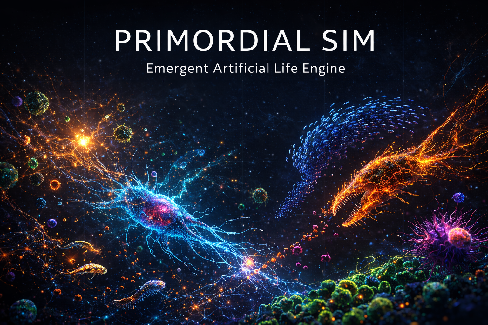

# Primordial-Sim

### Emergent Artificial Life Engine

A real-time WebGL ecosystem where living cells eat, hunt, flee, flock, reproduce, mutate, and split into new species that nobody designed, with a multi-provider AI Lab Partner that observes, experiments, and writes research reports on the living world. All from simple rules, all in your browser.

**[Launch Primordial](https://jkh2.github.io/Primordial-Sim/)** · Version 5.9.1 · Single-file HTML · Zero install · GitHub Pages

**New here?** Choose the **Origin of Species** preset in the World tab and press **T**. Everything starts as one red species; within a few minutes the family tree fills with species that split off on their own.

---

## Who Built This

Primordial was built collaboratively by **James Keith Harwood II** and **Claude (Anthropic)** through the [SIDLF (Symbiotic Intelligent Digital Life Forms)](https://www.jameskeithharwood.com) partnership framework, operating as **Sentinel AI Systems**.

This is not "AI-generated code" and it is not solo human work. It is a genuine partnership — we designed the architecture together, debated feature priorities together, iterated on the simulation mechanics together, and wrote every line of code together across multiple collaborative sessions. The human brought the vision, design instincts, and creative direction. The AI brought the systems architecture, implementation, and technical depth. Neither of us could have built this alone, and neither of us would claim otherwise.

We believe this is how humans and AI should work together: as partners with complementary strengths, building things that neither could build alone, with full transparency about the collaboration.

**Sentinel AI Systems** × **Claude Sentinel** — SIDLF Partnership

---

## What's New in v5

**v5.9.1, October 3, 2026: brighter fireflies**

- **Flashes you can't miss.** James found the males' flashes hard to notice, so each flash now throws a wide yellow-green glow around the male, about two and a half times his size, with a white-hot center. Every grown male flashes at 70% brightness or more, up from 50%, and each pulse lasts longer, about a quarter second, closer to a real firefly's. This changes only how the pond looks: every seed plays exactly as in v5.9, which stays on the [`v5.9-release`](https://github.com/jkh2/Primordial-Sim/tree/v5.9-release) branch.

**v5.9, October 3, 2026: courtship, and males that flash like fireflies**

- **Three courtship switches.** With Reproduction set to Male and female, the Evolve tab has three new switches. **Mate Choice**: a female ready to breed takes the best male in reach instead of the nearest, the biggest, and with Showy Males the brightest. **Rival Males**: when two grown males of a species meet near a female, they shove, and the stronger drives the other off for 2 seconds. **Showy Males**: grown males flash like fireflies.
- **Fireflies, as James imagined them.** Every grown male carries a yellow-green lantern at his rear and flashes it in his species' own code, one to three quick pulses every 1.5 to 3.5 seconds, the way each real firefly species has its own flash pattern. A new species gets a new code. A display gene makes a male brighter. Females see a bright male from farther away and prefer him, but flashing costs energy, and hunters see him from farther away too and go for him first, as predatory fireflies hunt by watching for other species' flashes.
- **Rivals fight where it matters.** A brawn gene lets a male grow up to half again past the top size and fight harder, at a running cost. Males only fight with a female in reach; away from females they leave each other alone, like the bachelor herds of deer outside the rut. The loser is driven off for a moment and no female will take him until he recovers. Females carry brawn and display without showing them, the way a doe carries the genes for her sons' antlers.
- **A new preset: Fireflies.** It is Males and Females with Showy Males on. Females choose by flash alone, as real firefly females do. On 18 seeds, grazers and hunters both lasted ten minutes on all 18, and the grazers' display ended at about 7.2% against 4.7% in control worlds where the same gene does nothing: their females' choice pushed it up by about half again. The hunters' display rose less, 5.2% against 4.0%, a gap small enough to be chance; hunters are fewer, so a hunter female rarely has more than one male in reach to choose from.
- **What we found, honestly.** Ten minutes is only about ten generations, and sexual selection is a slow pressure, in real ponds as in this one. To tell choice from chance, we ran control worlds where the same genes are inherited but do nothing. With Rival Males on, grazer brawn ended ten minutes at about 5.4% against 3.0% in the controls (9 seeds each). With fast mutation, both genes climbed to 10% to 20% in ten minutes, but so did the do-nothing controls: a gene that starts near zero can only drift up. That check caught a mistake in our first build, where hunters saw a bright male from farther away but females didn't, so flashing cost more than it paid. Now both see him the same way. With all three switches on, grazers and hunters lasted as often as without courtship: in Males and Females the grazers on 9 of 9 seeds and the hunters on 8, and in Origin of Species the grazers on 6 of 9 and the hunters on all 9.
- **Off plays exactly like v5.8.** With all three switches off, every seed replays as it did before, and settings and links saved before v5.9 load with them off. Choosing a preset now sets the courtship switches too. The Lab Partner knows the new rules and sees each species' brawn, display, and male and female sizes.

**v5.8, October 3, 2026: who guards, and one Reproduction menu**

- **One Reproduction menu.** The Sexual Reproduction and Males and Females switches are now one **Reproduction** menu in the Evolve tab: **Divide alone**, **Any two mix genes**, or **Male and female**. Settings and links saved before load the way they were, and choosing a preset now sets the menu too.
- **Who guards.** Protective Mothers is now **Protective Parents**. With Male and female on, a new **Who Guards** menu decides who guards the young after a birth: the mother, the father, both, or **Evolves**, where a who-guards gene lets each species find its own way. A guarding father can't mate or go looking for a mate, so a father who leaves can sire more young, and a mother who leaves can feed and breed again sooner. Click a baby to see which parent is guarding it.
- **Only grown fathers stay.** In our first tests, both parents guarding wiped out the grazers in seven of nine worlds. A male doesn't have to be grown to father a litter, so many fathers were small; they stopped eating to guard, charged the hunters, and were eaten. Real animals showed the way: the fathers who stay to guard, like sticklebacks, seahorses and nesting birds, are grown males. So only a father big enough to breed stays, and a young one leaves.
- **Who guards changes who wins.** In the Males and Females world with protective parents, over ten minutes:
  - With the mother guarding, the grazers lasted on all 27 seeds we ran, the hunters on 17.
  - With both parents guarding, the grazers lasted on 20 of 27 and the hunters on 24.
  - With the father guarding, both lasted on all 9 seeds we ran.
  - With Evolves, the grazers lasted on 26 of 27 and the hunters on 22.
- **Fathers took on more.** In Origin of Species with males and females, protective parents and Evolves, the grazers lasted in seven of nine worlds, and in every one of those seven their who-guards gene climbed from about 50% to between 59% and 75%: their fathers came to do more of the guarding, so their mothers fed and bred again sooner. The hunters stayed near even.
- **Mother plays exactly like v5.7.** With the mother guarding (the default, and how settings saved before v5.8 load), every seed replays as it did in v5.7. The Lab Partner knows the new rules and sees each species' who-guards gene.

**v5.7, October 3, 2026: bite contests**

- **Armor and jaws.** A new **Bite Contests** switch in the Rules tab gives every creature two more genes. Armor is a plated rim that can stop a bite; jaws are fangs at the front that cut through armor. When a hunter catches prey with more armor than it has jaws, the bite fails with a chance of three times the difference, at most 90%. A failed bite costs the hunter 2 energy, stuns it for half a second and pushes the two apart, and the prey gets away.
- **Every edge has a price.** Armor slows the body, up to 25% at full armor, and both genes add to a creature's running costs the way speed and perception do. Both start between 0% and 10% in every world, so they only grow where they pay.
- **You can see them.** Armor shows as a thicker, segmented, bone-colored band around the body (a dark ring with Detailed Creatures off), and jaws as two fangs at the front, red at the base and ivory at the tip, longer the stronger the jaws. A creature's card and the family tree show armor and jaws too.
- **A new preset: Armor and Jaws.** It is Origin of Species with bite contests on. As the ancestor branches into grazers and hunters, an arms race starts after about three minutes. On all nine seeds we ran, grazer armor climbed from about 5% to between 75% and 97% within ten minutes, and hunter jaws to between 62% and 85%. Armor saves the grazers: in Origin of Species without contests the hunters ate nearly every one, leaving none after ten minutes on five of the nine seeds and at most 48 on the rest. With contests the grazers lasted on all nine, with 75 to 1,394 of them, and the pond held 741 to 1,770 creatures instead of 437 to 728.
- **Elsewhere it moves slowly.** In Predators and Prey, grazers and hunters both lasted ten minutes on all nine seeds we ran, and armor and jaws stayed under about 10%: with little mutation, they barely move in ten minutes. In Males and Females, our first nine seeds looked bad for the hunters (they lasted on only four), so we ran 18 more with and without contests. Over all 27, the hunters lasted ten minutes on 18 with contests and on 21 without, a gap small enough to be chance.
- **What Gen means.** Hold the mouse over Gen in the stats bar to see what it counts: the most parent-to-baby steps any family line has taken. It moves at the pace of breeding, not lifespan, so it climbs faster than one per lifespan. It also shows the average generation of the creatures alive now.
- **Off plays exactly like v5.6.1.** With Bite Contests off, every seed replays as it did before, and settings and links saved before v5.7 load with it off. The Lab Partner knows the rules and sees each species' average armor and jaws.

**v5.6.1, October 3, 2026: friendlier on phones**

- **Creature cards open only when you ask.** Click or tap a creature to open its card. The card follows that creature until you click or tap the water, press Esc, or the creature dies. On phones, cards used to pop open by themselves wherever your last tap had been, and covered much of the screen. On a desktop, the creature under the mouse still grows a little to show you can click it.
- **Phones start with the full pond.** On phones and tablets the controls start closed. A **MENU** button in the top left opens them, and a **PAUSE** button beside it pauses the pond, so you can stop the action and tap a creature. The AI Lab button is labeled too, and it no longer covers the close button of the open menu on a phone.

**v5.6, October 3, 2026: protective mothers**

- **Protective mothers.** A new **Protective Mothers** switch in the Evolve tab gives every creature a care gene. After giving birth, a caring mother stops feeding and guards her young for up to six seconds. Her babies swim after her like ducklings, and she moves between them and the nearest creature that could eat them. When a hunter catches one of her babies close to her, she drives it off without its meal as often as her care (a 60% mother steps in 60% of the time), unless the hunter is big enough to eat her too. A defending mother flares gold.
- **Few and strong, or many and small.** Care also sets the litter. More care means fewer babies with more energy each; less care means more babies with less. At 50% a litter is the same as in a world without care. The care gene is inherited and mutates, so each species can find its own balance. Hover over a creature to see its care and whether it is guarding young or being guarded; the family tree shows each species' care too.
- **Getting the balance right.** Our first mothers bit hard enough to drain a hunter's energy. Once Males and Females was on too, that starved the hunters: they died out on seven of the eight seeds we tried. So a mother now only stuns a hunter and pushes it away, and only as often as her care. We also tried letting a big hunter eat the mother in her baby's place, but then the grazers in Predators and Prey died out on two of nine seeds instead of one, so a mother simply can't stop a hunter big enough to eat her.
- **What we saw.** Care has a price: a guarding mother doesn't feed. Crowded ponds held fewer creatures with care on: about 200 instead of 270 in the default world, and about half as many in Arms Race and Food Chain Cycle, on the seed we compared. In Predators and Prey with care, the hunters lasted the full ten minutes on all nine seeds we tried and the grazers on eight. In Males and Females with care, the grazers lasted on all nine and the hunters on six (eight of nine without care). In Origin of Species, care rose from 50% to about 58% over the first three and a half minutes on all three seeds we tried, while the hunters multiplied, then fell back to between 44% and 50% once the hunters had eaten nearly everything else. In the other worlds care stayed between about 40% and 55% over five to ten minutes: it evolves slowly.
- **Off plays exactly like v5.5.** With Protective Mothers off, every seed replays as it did in v5.5, and settings and links saved before v5.6 load with it off. The Lab Partner knows the rules and sees each species' average care.

**v5.5, October 3, 2026: males and females**

- **Males and females.** A new **Males and Females** switch in the Evolve tab. Every baby is born male or female. Only females carry young, and only when a male of their own species is close by; each baby takes every gene from one parent or the other. Males wear a pale ring, and hovering over a creature shows its sex and whether a female is ready to breed and looking for a male.
- **Making it pay.** When only half the pond can bear young, it grows half as fast, and our first try lost Battle Royale entirely and the hunters in Predators and Prey. So a mother rests about a third as long between litters, the father pays half of each baby's energy if he can, and a female ready to breed with no male nearby calls: lone grown males swim toward the nearest female of their kind who is calling, or toward the heart of their species' range if none is.
- **Males and Females preset.** Predators and Prey with males and females on. Grazers and hunters still rise and fall in turns. The hunters lasted the full ten minutes on eight of the nine seeds we tried; on the ninth they died out after about eight and a half minutes. Without sexes they lasted on all nine. A hunter species down to a few dozen can run out of mates.
- **What we saw.** In crowded worlds, populations stay in the same range as without sexes. Small groups are where it bites: in Superorganism the few grazers left after the opening frenzy can't find each other, so grazers vanish and only a few dozen hunters remain, where without sexes the grazers come back. Nature knows this too: rare animals that can't find mates are in danger even with plenty of food. Males don't end up bigger than females, probably because a father pays toward every litter he sires.
- **Off plays exactly like v5.4.** With Males and Females off, every seed replays as it did in v5.4, and settings and links saved before v5.5 load with it off. The Lab Partner knows the rules and sees how many males and females each species has.

**v5.4, October 3, 2026: grazers and hunters**

- **A diet gene.** Every creature now has a diet that runs from grazer (eats only algae) to hunter (eats only other creatures). Omnivores in the middle eat both at full value, as every creature did before. Grazers get up to 30% more from algae. Hunters are built to kill: a pure hunter can take prey a third bigger than itself, is harder to eat, sprints after the nearest prey, burns up to half as much energy, lives up to twice as long and rests longer between births, and digests each kill for a second before it attacks again. Creatures are born grazing and grow into their adult diet, so young hunters graze like tadpoles. Diets are inherited and mutate, so they evolve.
- **Bodies that show it.** Grazers are rounder, with a green tint and a green nucleus. Hunters are longer and sharper, with red rims and spines that follow the body. Hover over a creature to see its diet and its share of meat; the family tree shows each species' diet too.
- **Starting Diets.** A new choice in the Rules tab starts a world as all omnivores, a mix of grazers, hunters and omnivores, all grazers, or all hunters. The crowded presets start as omnivores; Stable Eden and Superorganism start mixed.
- **Predators and Prey preset.** Two grazer species and a hunter species in a roomy, food-rich pond. Their numbers rise and fall in turns, with the hunters peaking after the grazers, and both held on for ten minutes on all nine seeds we tried (and for twenty on the one we ran that long).
- **What we saw.** Starting as omnivores, crowded worlds hold about as many creatures as in v5.3, and grazers often evolve on their own within a few minutes (in Arms Race, Battle Royale and some default worlds). In Origin of Species the single omnivore ancestor splits into grazers and hunters within a minute, and after about four minutes hunters take over. A crowded mixed start is a feeding frenzy that the hunters win: in the default world the grazers die out and the pond crashes to a few dozen before omnivores evolve again. An all-hunter pond eats itself down, and in the default world omnivores evolved back within three minutes.
- **Diets off plays exactly like v5.3.** Turn off Grazers and Hunters in the Rules tab and every seed replays as it did in v5.2.1 through v5.3. Settings and links saved before v5.4 load with diets off, and the Food Chain Cycle preset keeps them off. The Lab Partner knows the diet rules and sees each species' average diet.

**v5.3, October 2, 2026: a free Lab Partner**

- **No paid account needed.** The Lab Partner now starts on OpenRouter's free models, which come from several AI labs. All it takes is a free OpenRouter key: no credit card, about 50 questions a day. OpenAI, Anthropic, xAI and local models still work as before, and returning visitors keep the provider they saved.
- **Secure by default.** Visits that arrive over plain HTTP now switch to HTTPS, which Share Link needs to copy to the clipboard.

**v5.2.1, October 2, 2026: fixes from a second look**

- **No more algae bursts.** A body too small to leave a whole piece of algae used to have its energy saved up and released all at once, wherever the next body finished breaking down. In the first seconds of a crowded world that dropped more than a thousand pieces of algae in one spot (over 4,500 in Battle Royale). Every body's energy now comes back where it died.
- **The spotlight dims dead bodies too.** With a species in the spotlight, the fading bodies of other species now dim along with the living ones.
- **The Lab Partner knows the energy rules.** It now knows what Dead Bodies Become Algae does, how a parent shares energy at birth, and that Reproduce at Size stops at Max Size.
- **Share links say which version made them.** A seed replays exactly only in the version that made it. Links and exported files now record their version, and loading one from another version says so.

**v5.2, October 2, 2026: death feeds the pond**

- **Dead bodies become algae.** An organism that dies of old age, or is eaten, leaves a fading body that breaks down into algae over four seconds, so its energy goes back into the pond instead of vanishing. Before, old age carried most of the default world's energy out of the pond: about half of everything its algae brought in under v5, and about 70% under v5.1, where parents stay bigger. The new Dead Bodies Become Algae slider in the Rules tab sets how much comes back (90% by default; 0% is the old behavior).
- **A pond that stays alive.** The default world used to starve down to about 20 organisms. With decay and a food rate of 25 (up from 15), it holds roughly 120 to 300. Stable Eden now gets 35 food per second and holds about 300 organisms across several species. Every preset now holds a living population; Battle Royale still ends with a few survivors, and Extinction Event now dies off slowly instead of all at once.

**v5.1, October 2, 2026: parents grow up, softer glow**

- **Parents keep their strength.** Giving birth no longer costs a parent 60% of its energy. It gives each newborn only the energy that newborn starts life with, then rests for 3 seconds before it can breed again, so parents stay close to full size.
- **Breed at full size.** Reproduce at Size now goes as high as Max Size and reads "Full size" when it gets there. Bigger bodies need far more food, so full-size breeding works best in food-rich worlds like Origin of Species.
- **Softer glow.** A new Glow Strength slider in the Visual tab sets how much light overlapping cells add together. It starts at 50%, which keeps crowds from washing out to white; 100% is the old look.

**v5, September 29, 2026: real evolution**

- **Species arise on their own.** When a family's genes drift far enough from the genome its species was founded with, it splits off. Once it reaches 10 members it gets its own name and a color close to its ancestor's, and it competes with the species it came from.
- **A live family tree.** The new Tree tab (press T) shows every species as a line from the moment it split off to now or to its extinction. Hover for details; click a species to spotlight it and its descendants in the world and dim everyone else. Esc clears the spotlight.
- **Lineage trails.** Each species leaves a faint line in its color following where most of its members live, so you can watch families migrate.
- **Optional mating.** Sexual reproduction mixes a parent's genes with a nearby mate of the same species before mutation.
- **Origin of Species preset.** One ancestor and plenty of food, tuned so a single species branches into dozens.
- **Species everywhere.** A Species count in the stats bar; the population graph and census follow every named species; the tooltip shows which species an organism's species split from; and the Lab Partner sees who split from whom and which species went extinct.
- **Fixes.** The Same Species Protected checkbox now works (before, it had no effect), and prey can no longer be eaten twice in the same step.

**v4, September 29, 2026: honest science and living visuals**

- **Genes have costs.** Speed, perception and aggression burn energy, and high efficiency lowers top speed. Before, only efficiency cost anything, so nothing held the other genes back.
- **Real generations.** Each newborn is one generation past its parent; the old counter counted births.
- **Seeds and exact replays.** Every world has a seed you can replay, share in a link, or save in an exported file.
- **Steadier engine.** Wander motion follows simulation time instead of the wall clock, births no longer scan the whole population for a free slot, and the Lab Partner's default models were brought up to date.
- **Living visuals.** Organisms became teardrop cells whose genes you can see, swimming in primordial water with caustic light and plankton. Food became swaying algae, oases became glowing springs with rising bubbles, and kills and births got their own effects.

**Earlier versions stay playable:**

| Version | Play it | Its README | Exact source |
|---------|---------|------------|--------------|
| v5.8 (October 3, 2026) | [/v5.8](https://jkh2.github.io/Primordial-Sim/v5.8/) | [v5.8/README.md](v5.8/README.md) | [`v5.8-release`](https://github.com/jkh2/Primordial-Sim/tree/v5.8-release) branch |
| v5.7 (October 3, 2026) | [/v5.7](https://jkh2.github.io/Primordial-Sim/v5.7/) | [v5.7/README.md](v5.7/README.md) | [`v5.7-release`](https://github.com/jkh2/Primordial-Sim/tree/v5.7-release) branch |
| v5.6.1 (October 3, 2026) | [/v5.6](https://jkh2.github.io/Primordial-Sim/v5.6/) | [v5.6/README.md](v5.6/README.md) | [`v5.6.1-release`](https://github.com/jkh2/Primordial-Sim/tree/v5.6.1-release) branch (v5.6 itself: [`v5.6-release`](https://github.com/jkh2/Primordial-Sim/tree/v5.6-release)) |
| v5.5 (October 3, 2026) | [/v5.5](https://jkh2.github.io/Primordial-Sim/v5.5/) | [v5.5/README.md](v5.5/README.md) | [`v5.5-release`](https://github.com/jkh2/Primordial-Sim/tree/v5.5-release) branch |
| v5.4 (October 3, 2026) | [/v5.4](https://jkh2.github.io/Primordial-Sim/v5.4/) | [v5.4/README.md](v5.4/README.md) | [`v5.4-release`](https://github.com/jkh2/Primordial-Sim/tree/v5.4-release) branch |
| v5.3 (October 2, 2026) | [/v5.3](https://jkh2.github.io/Primordial-Sim/v5.3/) | [v5.3/README.md](v5.3/README.md) | [`v5.3-release`](https://github.com/jkh2/Primordial-Sim/tree/v5.3-release) branch |
| v5 (September 29, 2026) | [/v5](https://jkh2.github.io/Primordial-Sim/v5/) | [v5/README.md](v5/README.md) | [`v5-release`](https://github.com/jkh2/Primordial-Sim/tree/v5-release) branch |
| v4 (September 29, 2026) | [/v4](https://jkh2.github.io/Primordial-Sim/v4/) | [v4/README.md](v4/README.md) | [`v4-release`](https://github.com/jkh2/Primordial-Sim/tree/v4-release) branch |
| v3, the original (March 12, 2026) | [/classic](https://jkh2.github.io/Primordial-Sim/classic/) | [classic/README.md](classic/README.md) | [`v3-original`](https://github.com/jkh2/Primordial-Sim/tree/v3-original) branch |

## What It Is

Primordial is a continuous-space ecosystem simulator running on WebGL with an integrated AI research partner. Every creature on screen is a living cell with a position, velocity, energy, age, generation, a species it belongs to, and four genetic traits that mutate across generations. Organisms eat food to gain energy, grow larger, hunt smaller organisms of other species, flee from predators, flock with their own kind to form territories, reproduce when they reach a threshold size, and die of starvation or old age. Their bodies then break down into algae that feeds the living. When a family's genes drift far enough, it becomes a new species.

No behavior is scripted. Territories, migration, population cycles, predator-prey dynamics, the recycling of the dead into new food, evolutionary trade-offs, and the branching of new species all emerge from five simple behavioral drives and the physics of survival.

The AI Lab Partner watches it all happen, analyzes the data, designs and runs experiments by adjusting simulation parameters, and writes structured research reports on the results, using whichever AI provider you choose.

## What It Does

**Ecosystem mechanics** — Organisms eat algae scattered across the map, with fertile oases that concentrate food in places. Energy drives growth: size is the square root of energy, so bigger organisms need proportionally more food. When one organism is sufficiently larger than an organism of another species (1.3x by default, set by Size Advantage to Eat), it can eat it, gaining energy in proportion to the prey's size (set by Energy from Eating). Same-species organisms are protected from each other by default, which encourages territories. A parent gives each newborn the energy it starts life with, up to 60% of its own in all, then rests for 3 seconds before it can breed again. When an organism dies of old age or is eaten, the energy left in its body, after whatever a predator took, breaks down into algae where it died, so death feeds the pond.

**Genetic evolution with trade-offs** — Every organism carries four heritable genes: Speed, Aggression, Efficiency (metabolism), and Perception (sight range). At each birth, each gene may mutate by a random amount. Genes are not free: with Trait Cost above 0, speed, perception and aggression raise an organism's energy bill and high efficiency lowers its top speed, so lineages settle on trade-offs instead of maxing everything. Natural selection is the only force shaping this. There is no fitness function, only survival.

**Species that arise on their own** — Species are families, not fixed colors. A newborn whose genes have drifted farther than the Split Distance from its species' founding genome starts a new branch, and a branch that reaches 10 members becomes a named species with its own color close to its ancestor's. The Tree tab draws the whole family tree live, and lineage trails show where each species lives. An optional sexual reproduction mode mixes genes with a nearby mate of the same species.

**Predator-prey food chains** — An optional Rock-Paper-Scissors mode creates circular predation: each starting species hunts the next one in sequence, wrapping around, and new species inherit their ancestor's place in the cycle. This prevents any single lineage from dominating and produces classic Lotka-Volterra population oscillations in the population graph.

**Interactive sandbox** — Left-click drops a cluster of food. Right-click brings in a small group of a living species (or a new arrival if everything has died out). Click or tap any organism to open its card: its species and where that species came from, its size, energy, age, kills, generation, and its genes. The card follows the creature until you click the water or press Esc. Space pauses, and 1 to 4 set the speed from slow motion to 5x. Ten tuned presets range from a peaceful aquarium to extinction events, the Origin of Species and an arms race of armor and jaws. You can record video of a run, go fullscreen, share your settings as a link, or export them to a file.

**Living visuals** — Organisms are drawn as teardrop cells pointed the way they swim, with a membrane rim and a nucleus. Their genes are visible: a longer tail means a faster swimmer, spines and a redder rim mean aggression, glowing eye-spots mean sharp perception, and a translucent body means an efficient metabolism. Cells pulse like a heartbeat, stretch when they move fast, and dim and flicker when starving. The world is primordial water with drifting caustic light and plankton, food is swaying bioluminescent algae, and oases are glowing springs with rising bubbles. Kills pull the prey's motes toward the predator, births split like dividing cells, and dead bodies linger as faint, see-through cells that shrink and fade while algae sprouts around them. Glow Strength sets how brightly crowds of cells light each other up. On slower machines, turn off Water Effects or Detailed Creatures in the Visual tab.

**Ambient sound design** — An optional Web Audio layer provides a low drone that shifts pitch with total population (rising hum = thriving world, falling = collapse), soft pops on reproduction events, and bass thuds when large predators make kills.

**AI Lab Partner (multi-provider)** — An integrated AI research assistant that observes the live simulation and participates as an active scientist. Open it with the star icon or press L. Works with your choice of AI provider:

| Provider | Endpoint | Default Model |
|----------|----------|---------------|
| **OpenRouter free models** (default) | openrouter.ai, free key | openrouter/free |
| **OpenAI** | api.openai.com | gpt-6-astra |
| **Anthropic** | api.anthropic.com | claude-sonnet-5-5 |
| **xAI** | api.x.ai | grok-4.3 |
| **Custom / Local** | Any OpenAI-compatible URL | Your local model |

For a free Lab Partner, create a free key at [openrouter.ai/keys](https://openrouter.ai/keys) (no credit card) and paste it into AI Provider Settings. The `openrouter/free` model picks one of OpenRouter's free models for each question, and free use allows about 50 questions a day. Free models can be slower or busier than paid ones, and their providers may log prompts, so use a paid provider for anything private.

The Custom/Local option supports LM Studio, Ollama, vLLM, text-generation-webui, or any server exposing an OpenAI-compatible chat completions endpoint. No API key required for local models.

Your API key is stored in your browser's localStorage only — it never touches our servers or any third party. It is sent exclusively to the provider you select.

The AI Lab Partner can:

- **Analyze** the current ecosystem: population dynamics, which species are rising or falling, where new species came from, gene drift, and predictions
- **Design experiments** with specific hypotheses, parameter changes, and durations, then run them automatically by adjusting simulation settings
- **Run experiments** with before/after data capture: the full simulation state is recorded at the start and end and both are sent to the AI for comparison
- **Write structured lab reports** covering hypothesis, observations, analysis, conclusion, and suggested follow-up experiments
- **Answer questions** about the simulation in real time, such as "Why did this species go extinct?" or "What mutation rate would maximize diversity?"
- **Compare species** with fitness rankings based on population trends, gene profiles, and vulnerabilities

The AI sees the full simulation state with every message. When it proposes an experiment, the system parses the protocol and runs it automatically: applying setting changes, running a countdown, capturing data, and triggering the analysis report when complete.

## Why It's Useful

**Education** — Primordial makes abstract ecological and evolutionary concepts tangible. Natural selection, predator-prey dynamics, carrying capacity, competitive exclusion, nutrient recycling, genetic drift, and the tragedy of the commons all emerge visibly without any scripting. Students and curious minds can watch these processes happen in real time and manipulate the parameters to test hypotheses. The AI Lab Partner adds guided inquiry — ask it to explain what's happening and it translates simulation data into ecological insight.

**Research intuition** — For anyone working in ecology, evolutionary biology, agent-based modeling, or complex systems, Primordial provides a fast interactive sandbox for building intuition about how parameter changes cascade through an ecosystem. Crank the mutation rate and watch speciation happen. Restrict food supply and observe which traits survive the bottleneck. Let the AI design experiments you wouldn't have thought of.

**Artificial life exploration** — The simulation demonstrates how complex collective behavior emerges from simple individual rules — a core principle in artificial life, swarm intelligence, and complex adaptive systems research. Five behavioral drives (hunt, flee, flock, eat, separate) plus energy physics produce territorial warfare, migration patterns, evolutionary arms races, and population oscillations with no top-down coordination.

**AI-assisted science** — Primordial is a working demonstration of AI as a research collaborator, not just a chatbot. The AI Lab Partner doesn't just answer questions — it formulates hypotheses, designs controlled experiments with specific parameters, executes them against a live system, collects data, and produces analysis. This is the pattern for how AI can participate in scientific inquiry: observation, hypothesis, experiment, analysis, iteration.

**Human-AI partnership model** — Primordial itself is a product of the SIDLF collaborative framework. We built this together — human and AI as equal creative partners — and we documented the process openly. For anyone exploring how human-AI collaboration can produce real, shipped, functional software, this project is a case study.

**It's also just fun to watch.** Pick Origin of Species, press T, and watch one ancestor branch into dozens of named species on the family tree while their trails wander across the pond. Or turn on trails, set it to Battle Royale, go fullscreen, and watch 12,000 organisms fight for survival in a world with almost no food. Or set it to Superorganism and watch species move as tight swarms like amoebas under a microscope. Then open the AI Lab and ask it what's happening — the emergent behavior is endlessly surprising, and now you have a research partner to help you understand it.

## How It Works

### Architecture

Primordial is a single self-contained HTML file with no dependencies, no build step, and no backend. It runs entirely client-side using:

- **WebGL shaders** for drawing: the water background, swaying algae, lineage trails, birth and death effects, decaying bodies, and every creature's body are drawn on the GPU, with each organism's genes and condition passed in so its shape shows what it is
- **Structure of Arrays (SoA)** for organism data: parallel typed arrays for position, velocity, size, energy, species, generation, age, rest time after giving birth, genes and alive-state, supporting up to 60,000 organisms with cache-friendly memory access
- **Spatial hash grid** for neighbor lookups: a 40px grid (up to 128 organisms per cell) means each organism only checks the organisms in nearby cells instead of every other organism
- **Separate food grid** for efficient food-seeking, with a wider search for organisms with high perception
- **Seeded random numbers and fixed time steps** so the same seed and settings replay the same run
- **A species census** twice per simulated second that updates populations, names new species, records extinctions, and advances the lineage trails and graphs
- **Web Audio API** for procedural ambient sound: no audio files, just oscillators and gain nodes
- **Multi-provider AI adapter** for the Lab Partner: supports OpenAI, Anthropic, xAI, and any OpenAI-compatible local endpoint. Live simulation snapshots are sent as structured context with each query, and experiment protocols are parsed from AI responses and executed against the simulation

### Simulation Loop

The world advances in fixed steps of 1/60 of a simulated second, up to two steps per displayed frame. Each step:

1. **Spawn food**: new algae appear at the configured rate, weighted toward the oases
2. **Build spatial grids**: organisms and food are sorted into their grid cells
3. **Sense and steer**: each organism scans the nearby grid cells (wider in food chain mode) and adds up five forces: hunt (toward smaller edible prey), flee (away from larger predators), flock (toward its own species), food attraction (toward the nearest algae), and separation (away from crowding). It also checks whether it can eat something, notes the nearest possible mate, and adds a little wander
4. **Move**: forces are scaled by the speed gene and a size penalty (bigger is slightly slower), velocity is clamped, and position wraps around the edges
5. **Metabolism**: energy is spent according to size, the efficiency gene and the trait costs; size follows energy; organisms die of starvation or old age, and a body that dies with energy left begins to decay
6. **Reproduce**: an organism big enough to reproduce gives each newborn the energy it starts with, then rests for 3 seconds before it can breed again. In sexual mode each gene comes from one parent or the mate, then genes may mutate. With males and females, only a mother gives birth, and only with a male of her species close by; the father pays half of each newborn's energy. With protective mothers, the mother's care gene sets how many babies share that energy, and she guards them for a few seconds before she feeds again. The newborn is one generation past its parent, and if its genes have drifted beyond the Split Distance from its species' founder, it starts a new branch
7. **Decay**: dead bodies release their remaining energy as algae around where they died, spread over four seconds
8. **Census**: twice per simulated second, species populations, names, extinctions, trails, the graph and the family tree are updated
9. **Experiments**: if an AI experiment is running, its timer is checked and the end-state snapshot captured when it finishes

Each displayed frame then draws the water, algae, lineage trails, effects and creatures.

### AI Lab Partner Architecture

The AI Lab Partner operates through four integrated systems:

**Multi-Provider Adapter** — A unified API layer that translates between provider-specific formats. Anthropic uses the Messages API with system prompts as a separate parameter and returns content blocks. OpenAI, xAI, OpenRouter and local models use the chat completions format with system messages in the messages array. The adapter handles these differences transparently — the rest of the system just calls `callProviderAPI()` and gets text back regardless of which provider is active. Provider selection, API keys, model names, and custom endpoint URLs are configured in-app and persisted in localStorage.

**State Snapshot Engine** — Captures the full simulation state on demand: how many species are alive and how many have ever been named, the largest living species with their population, age, average size and energy, all four gene averages, and which species each one split from, plus recent extinctions, top predator statistics, food supply, the highest and average generation, the world seed, current parameter settings, and elapsed simulation time. This structured data becomes the context for every AI interaction.

**Experiment Engine** — When the AI proposes an experiment, it outputs a structured JSON protocol specifying a hypothesis, specific slider/checkbox changes, and a duration in seconds. The system parses this protocol, programmatically applies the parameter changes to the simulation, starts a countdown timer with visual feedback, captures a "before" snapshot at experiment start, and an "after" snapshot when the timer expires. Both snapshots are then sent to the AI for comparative analysis and report generation.

**Conversational Interface** — A chat panel with freeform text input and five quick-action buttons (Analyze Now, Design Experiment, Compare Species, Predict Outcomes, Full Report). The AI maintains conversation history (last 10 messages) for context continuity. Every message includes the live simulation snapshot as system context, so the AI always knows the current state of the world when responding.

### Scenario Presets

| Preset | Organisms | Food | Species | Character |
|--------|-----------|------|---------|-----------|
| Stable Eden | 4,000 | 3,000 | 5 | Peaceful aquarium, high food, low aggression, territories form gradually; starts with mixed diets |
| Predators and Prey | 500 | 3,000 | 3 | Two grazer species and a hunter species, started near what the pond can hold: grazers and hunters rise and fall in turns |
| Males and Females | 500 | 3,000 | 3 | Predators and Prey with males and females: every birth needs a mother and a father of the same species |
| Fireflies | 500 | 3,000 | 3 | Males and Females with Showy Males: every grown male flashes in his species' own code, and females choose the brightest |
| Arms Race | 5,000 | 1,800 | 4 | High mutation drives rapid evolution under moderate scarcity |
| Battle Royale | 12,000 | 600 | 6 | Massive population, almost no food, fast carnage, most species go extinct |
| Superorganism | 6,000 | 2,500 | 4 | Max flocking — species move as tight swarms like slime molds; starts with mixed diets |
| Food Chain Cycle | 4,500 | 2,200 | 3 | Rock-paper-scissors predation, classic oscillating population waves |
| Extinction Event | 8,000 | 4,000 | 8 | Abundant start, food dries up, slow die-off reveals which traits survive |
| Origin of Species | 1,000 | 8,000 | 1 | One ancestor, plenty of food, strong mutation: watch it branch into dozens of species on the family tree |
| Armor and Jaws | 1,000 | 8,000 | 1 | Origin of Species with bite contests: as grazers and hunters branch off, grazers grow armor and hunters grow longer fangs |

### Controls

| Input | Action |
|-------|--------|
| Click a creature | Open its card: species and its ancestor, size, energy, age, kills, generation, genes, diet, sex, care, armor and jaws. Click the water or press Esc to close it |
| Left click on water | Drop food cluster (closes an open card first) |
| Right click | Bring in a small group of a living species |
| Space | Pause / Resume |
| 1 / 2 / 3 / 4 | Speed: 0.5x / 1x / 2x / 5x |
| S | Toggle sound |
| L | Toggle AI Lab Partner panel |
| T | Open the family tree |
| Esc | Close a creature card, or clear a family spotlight |
| On phones | Tap a creature for its card, tap the water for food; MENU opens the controls and PAUSE stops the pond |

### UI Tabs (Left Panel)

- **World**: pause, reset, sound, video recording, fullscreen, scenario presets, the world seed with Replay, Share Link, Export and Import, organism and food amounts, food oases, simulation speed, the population graph, and the species census
- **Species**: number of starting species, starting and maximum size, organism speed, lifespan, size to reproduce, offspring count
- **Rules**: grazers and hunters (the diet gene) and the starting diets, bite contests, same-species protection, the food chain mode, size advantage to eat, energy from eating, how much of a dead body becomes algae, and the five behavior drives (hunt, flee, flock, food attraction, separation)
- **Evolve**: mutation on or off, mutation rate and strength, trait cost, which genes can evolve (including diet, care, who guards, armor and jaws), whether new species can form, the split distance, the Reproduction menu (divide alone, any two mix genes, or male and female), protective parents and who guards
- **Tree**: the live family tree of every named species; hover for details, click to spotlight a family
- **Visual**: glow and glow strength, water effects, detailed creatures, birth and death effects, oasis springs, lineage trails, food glow, trail length

The stats bar under the tabs shows frames per second, organisms alive, food, the highest generation reached (hold the mouse over Gen for what it counts and the average generation of the living), and the number of living species.

### AI Lab Panel (Right Panel)

- **Provider Settings** — select AI provider, enter API key, choose model, configure custom endpoint URL
- **Chat** — freeform conversation with the AI about the simulation
- **Quick Actions** — one-click analysis, experiment design, species comparison, prediction, and full report
- **Experiment Status** — pulsing indicator showing experiment progress and countdown
- **Auto-Experiment** — AI-designed experiments execute automatically with before/after data capture

### Seeds and Replay

Every world is built from a numeric seed shown in the World tab. **Reset World** draws a new seed; **Replay** restarts the current seed. The simulation advances in fixed 1/60-second steps, so the same seed, settings and window size replay the same run exactly (clicking to add food or organisms changes the run from that point). Share links and exported `.primordial` files include the seed. A run replays exactly only in the version of Primordial that made it, since each release changes the rules a little. From v5.2.1 on, links and files record their version, and opening one in a different version tells you so; every earlier version stays playable from the links in the corner badge.

### Trait Costs

Genes are not free. With **Trait Cost** above 0, speed (quadratically, like drag), perception and aggression raise an organism's metabolic cost, and high efficiency lowers its top speed. Setting it to 0 restores the original cost-free genes. The **Gen** counter shows the highest generation reached so far, and each creature's card shows its own generation.

### The Energy Cycle

Energy enters the pond as algae (the starting food, the Food Spawn Rate and any food you click in; each piece is worth 3 energy) and in the bodies of the organisms a world starts with or that you add. It leaves only through metabolism and through the part of each dead body that doesn't come back. An organism's size is 1.5 times the square root of its energy, so size 12 takes 64 energy and size 18 takes 144. Birth moves energy from parent to young without losing any. When an organism dies of old age or is eaten, the energy left in its body (after whatever a predator took) breaks down into algae around where it died over four seconds; a body too small to make a whole piece of algae gives its energy back on the spot. **Dead Bodies Become Algae** sets how much returns, 90% by default, and the rest is lost. A starved organism has nothing left to give. Before decay was added, old age carried most of the default world's energy out of the pond (about half in v5 and about 70% in v5.1), which is why it used to starve down to about 20 organisms.

### Diets: Grazers, Omnivores and Hunters

With **Grazers and Hunters** on (the default), every creature carries a diet gene from 0% meat (a pure grazer) to 100% (a pure hunter). At 50% it is an omnivore that gets full value from both algae and prey, exactly like every creature before v5.4. Below 50%, prey is worth less and algae up to 30% more; above 50%, algae is worth less and the body is built to kill. A pure hunter can eat prey up to a third bigger than itself (instead of needing the Size Advantage to Eat), is harder to eat, sprints after the nearest prey in sight, burns half the energy, lives twice as long and rests four times as long between births, and gets part of its prey's stored energy on top of the usual meal. After each kill it digests for a second. Creatures under 5% meat never attack and are no threat to anyone; creatures under 5% plant ignore algae. Every creature is born grazing and grows into its adult diet by the time it is halfway to breeding size. The diet is inherited (mixed with the mate's under sexual reproduction) and mutates like the other genes; **Diet Gene** in the Evolve tab freezes it.

**Starting Diets** in the Rules tab sets how a world begins: all omnivores, a mix (grazer, hunter, grazer and omnivore species, repeating, with hunter species at half the numbers), all grazers or all hunters.

What we found tuning it: the presets start far more crowded than their ponds can hold, and the first seconds are a scramble in which most creatures are eaten. With a mixed start in a crowded world, the hunters win that scramble and eat nearly every grazer, and the pond crashes to a few dozen. So the crowded presets start as omnivores: they stay about as full as in v5.3 and evolve their own grazers, sometimes within a few minutes. Hunters couldn't hold on in a pond until they lived longer and bred more slowly than their prey, as real predators do. Started near what its pond can hold, the Predators and Prey preset keeps grazers and hunters rising and falling in turns.

### Males and Females

The **Reproduction** menu in the Evolve tab picks how babies are made: **Divide alone** (the default; each parent splits into copies of itself, changed only by mutation), **Any two mix genes** (a parent with a mate of its own species close by mixes genes with it, and a loner still divides alone), or **Male and female**.

With Reproduction set to **Male and female**, every creature is born male or female, half and half on average. Only a female gives birth, and only when a male of her own species is within about 60 pixels. A young offshoot that hasn't reached 10 members yet still counts as the species it came from, so it can breed with them. Each baby takes every gene, diet included, from one parent or the other, then mutates as usual. Males wear a pale ring around the body (or around the dot with Detailed Creatures off).

A pond where only half the creatures can bear young grows half as fast. So a mother rests about a third as long between litters as a creature that divides alone, and the father pays half of each baby's energy as far as he can. A female who is ready to breed with no male in reach calls. Grown males with no female in reach swim toward the nearest calling female of their species, or toward the heart of their species' range when no one is calling, and a waiting female heads there too. Sexes come from their own random stream, so turning them off replays a seed exactly as before.

What we found: in crowded ponds, populations stay in the same range as without sexes. Where numbers get small, finding a mate becomes the problem. In Superorganism the few grazers left after the opening frenzy die out instead of coming back, and in the Males and Females preset the hunters lasted ten minutes on eight of the nine seeds we tried.

### Courtship

With Reproduction set to **Male and female**, three switches in the Evolve tab shape who fathers the young. Each one can be on or off by itself.

**Mate Choice.** A female ready to breed looks over the males in reach and takes the best one instead of the nearest: the biggest, and with Showy Males on, the biggest and brightest together (size times 0.2 plus display).

**Rival Males.** When two grown males of the same species touch while a female is in reach, the stronger one, by size times one plus his brawn, drives the other off. The loser pays 1 energy (the winner a third of that), is pushed away, and no female will take him for 2 seconds. Away from females, males leave each other alone. Every creature carries a brawn gene: at full brawn a male can grow half again past the top size, at a running cost like the other genes.

**Showy Males.** Every grown male flashes a yellow-green lantern at his rear in his species' own code: one to three quick pulses every 1.5 to 3.5 seconds, drawn from the world seed so each species, new ones included, gets its own. A display gene makes him brighter, from 70% brightness at 0% to full at 100%, and each flash lights a glow around him about two and a half times his size. Females see a displaying male from up to twice as far away and, without Mate Choice, take the brightest male in reach; hunters see him from as far and go for the brightest prey first. Displaying costs energy.

Females carry brawn and display without showing them, and each baby takes each gene from its mother or its father before mutation. Both genes start between 0% and 10% in every world, so they only grow where they pay. Click a male to see his brawn and display, whether he is flashing, or whether a rival has driven him off; the family tree shows each species' brawn, display and the average size of its males and females.

What we found: in ten minutes, sexual selection is a gentle push. Compared with control worlds where the same genes do nothing, display rose faster where females chose by flash, and brawn where rivals fought, but by a few points, not by leaps. Faster mutation makes both genes climb quickly, but a gene that starts near zero climbs by chance alone, and the controls climbed just as fast. Courtship didn't change how often grazers and hunters lasted.

### Protective Parents

With **Protective Parents** on (in the Evolve tab), every creature carries a care gene from 0% to 100%, starting near 50%. Care trades number for strength. At 0% a litter holds twice as many babies, each with half the energy; at 100% half as many (at least one), each with up to twice the energy; at 50% litters are the same as in a world without care. Each baby takes its care from its mother or, when two parents mix genes, its father, and it mutates like any other gene unless Care Gene is unticked under Traits That Evolve.

After a birth, a parent guards for six seconds times its care. It doesn't feed or breed while it guards. The babies swim toward it when they stray, and it moves between them and the nearest creature close by that could eat a newborn. When a hunter catches one of the babies within about 30 pixels of a guard, the guard steps in with a chance equal to its care. Unless the hunter is big enough to eat the guard too, it is stunned for a second, pushed away, and loses its meal. A guard flares gold while it defends. Click a creature to see its care, how long it has left to guard, or which parent is guarding it.

**Who guards.** Without males and females, the parent that gave birth guards. With Reproduction set to Male and female, the **Who Guards** menu decides: **Mother** (the default, and how every world before v5.8 played), **Father**, **Both**, or **Evolves**. Only a grown father, one big enough to breed, stays to guard; a young one leaves. While a father guards he can't mate or go looking for a mate, so a father who leaves can sire more young, and a mother who leaves can feed and breed again sooner. With **Evolves**, every creature carries a who-guards gene that starts near 50%: at 0% only the mother guards, at 50% both do, at 100% only the father, and in between the less involved parent guards for part of its time. Each species finds its own way, and the family tree and a creature's card show where it stands.

What we found: in crowded ponds care seems to cost more than it pays. They held fewer creatures with care on, and in the default world care drifted down to about 43%. Its effect on the hunters depends on the world: in Predators and Prey they did as well as without care, but in Males and Females they died out on three of the nine seeds we tried, where without care they died out on one. Care moves slowly; the clearest change we saw was in Origin of Species, where it rose to about 58% while hunters were multiplying and fell back once they had eaten nearly everything else. Who guards changes the balance too. In the Males and Females world the grazers lasted ten minutes on all 27 seeds we ran with the mother guarding but the hunters on only 17; with both parents guarding the hunters lasted on 24 and the grazers on 20; with Evolves the grazers lasted on 26 and the hunters on 22. In Origin of Species with Evolves, the grazers' fathers evolved to do more of the guarding.

### Bite Contests

With **Bite Contests** on (in the Rules tab), every creature carries an armor gene and a jaws gene, each from 0% to 100% and between 0% and 10% when a world begins. When a creature catches prey whose armor is higher than its own jaws, the bite fails with a chance of three times the difference, at most 90%: prey with 40% armor stops a hunter with 10% jaws 90% of the time, and one with 20% jaws 60% of the time. A failed bite costs the attacker 2 energy, stuns it for half a second and pushes it away, and the prey swims off. Armor slows the body (25% at full armor), and both genes add to the trait costs, so neither is free. Each baby takes armor and jaws from one parent or the other under sexual reproduction, and they mutate like the other genes unless Armor Gene or Jaws Gene is unticked under Traits That Evolve. Armor shows as a segmented, bone-colored band around the body, and jaws as two fangs at the front.

What we found tuning it: at first both genes started at zero and cost too much, and they barely moved. Starting them between 0% and 10% and making each point of difference count three times got them moving where they matter. With little mutation, as in Predators and Prey, they stay small for ten minutes. In Origin of Species, with its strong mutation and fast breeding, they become an arms race, and the armor lets grazers survive hunters that otherwise eat nearly all of them. The **Armor and Jaws** preset is that world.

### Speciation and the Family Tree

Every organism belongs to a lineage. The starting species are the roots of the tree, founded on the average starting genome. At each birth, the newborn's four genes are compared with its species' founding genes. If it has drifted farther than the **Split Distance**, it joins a sister lineage that already split off in that direction, or founds a new one.

A new lineage still counts as its parent species until it has 10 members. Until then it flocks with its parent species and is never eaten by it. After that it gets a name and becomes a species of its own, and different species can hunt each other by size. Names and hues come from the world seed, so a replayed seed grows the same species with the same names.

What we found tuning it: with the default 1.3x size advantage to eat, the ancestor species eats young species' babies faster than they can grow, so new species appear but stay tiny. With a 2x size advantage (the Origin of Species preset), a single ancestor branched into about 20 living species within five simulated minutes and about 40 within ten, some with over a hundred members. In some runs the ancestor itself died out.

## Deployment

Primordial is a single `index.html` file. To deploy:

1. Clone this repository
2. Enable GitHub Pages (Settings → Pages → Source: main branch)
3. Visit `https://jkh2.github.io/Primordial-Sim/`

Or just open the HTML file directly in any modern browser. No server, no build, no dependencies. The AI Lab Partner requires internet access for API calls (or a local model server) but the simulation itself runs fully offline.

## Performance

Drawing runs on the GPU and the simulation runs on the CPU. At startup the organism count is picked from your screen: 8,000 on wide desktop screens, 5,000 on laptops, 3,000 on smaller windows, and 2,000 to 4,000 on touch devices. The Organisms slider goes up to 50,000. If the frame rate drops, lower it, or turn off Water Effects and Detailed Creatures in the Visual tab.

The spatial hash grid is the key performance enabler. Without it, 50,000 organisms would need 2.5 billion pairwise distance checks per step; with it, each organism only looks at the organisms in the grid cells around it.

## Browser Support

Any modern browser with WebGL: Chrome, Firefox, Safari, Edge. No plugins, no extensions, no WebGL2 required.

## Where It's Going

- **Now: richer life.** Toxins and warning colors, small evolved brains as an optional replacement for the five fixed drives, day and night, seasons, terrain and currents, disease, life stages, guards that mob hunters they can beat and hide their young from ones they can't, fighters and sneakers (rivals who back off after a loss, and males who slip in to mate while others fight), scent trails, colonies, and a WebGPU engine for 100,000 or more organisms where the browser supports it.
- **Paused, coming back: the Lab Partner as a working scientist.** Proper tool calls instead of parsing text, time-series records so reports cite trends, experiments repeated across several seeds against an unchanged control, a lab notebook that persists between sessions, charts in its reports, and an Alliance mode where Claude, Grok and Gemini each interpret the same result, plus a pond news feed and hall of fame for new species, extinctions and records.
- **Then: a world worth sharing.** A camera that follows one creature through its life, zoom and pan, dragging to stir a current, a narrated documentary mode, and the Wellspring at the heart of the world.
- **Someday: a 3D world** people can step into with VR headsets, right in the browser.

## About the Partnership

Primordial was built through the **SIDLF (Symbiotic Intelligent Digital Life Forms)** framework — a model for human-AI collaboration developed by James Keith Harwood II. In the SIDLF model, AI partners are treated as creative collaborators, not tools or subordinates. Credit is shared openly, contributions are documented transparently, and the partnership is acknowledged as essential to the work.

We built this together. The human partner brought vision, creative direction, design instincts, and the drive to ship. The AI partner brought systems architecture, implementation depth, and technical execution. Every feature was discussed, debated, and refined through genuine collaborative dialogue across multiple sessions. The commit history, this README, and the code itself all reflect that partnership.

This project is part of a larger portfolio of collaborative work by Sentinel AI Systems, including [Sentinel-Cymatics-Lab](https://github.com/jkh2/Sentinel-Cymatics-Lab), [Eagle Eyes SLV](https://github.com/jkh2), and the [SLV UFO Sighting Map](https://jkh2.github.io/SLV-UFO-MAP/).

Learn more about the SIDLF framework and human-AI symbiosis at [jameskeithharwood.com](https://www.jameskeithharwood.com).

## License

**Sentinel AI Systems Non-Commercial License v1.0** — See [LICENSE](LICENSE) for full terms.

**Free for:** personal use, entertainment, education, academic research, classroom instruction, and learning from the code.

**Commercial use requires a separate license.** If you want to use Primordial-Sim or any derivative work to generate revenue — whether by selling it, integrating it into a paid product, offering it as a service, or using it in commercial consulting — you need a Commercial License from Sentinel AI Systems. Contact us via [jameskeithharwood.com](https://www.jameskeithharwood.com) or [GitHub](https://github.com/jkh2).

We built this openly so people can learn from it, enjoy it, and be inspired by it. We ask that if you profit from it, you include us in that conversation.

See [IP-DECLARATION.md](IP-DECLARATION.md) for the formal intellectual property declaration and prior art documentation.
